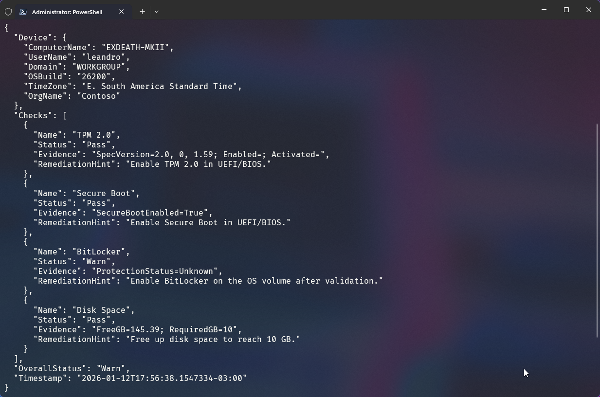
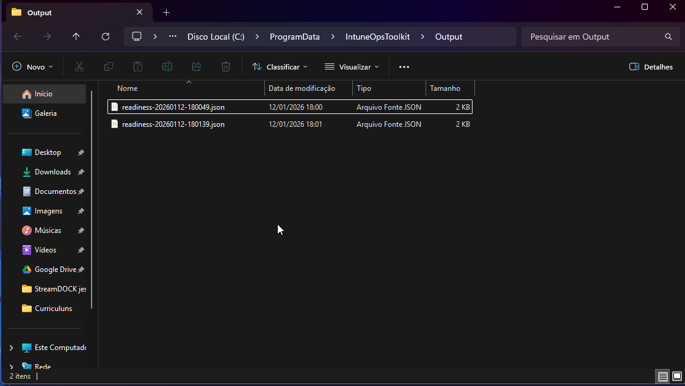
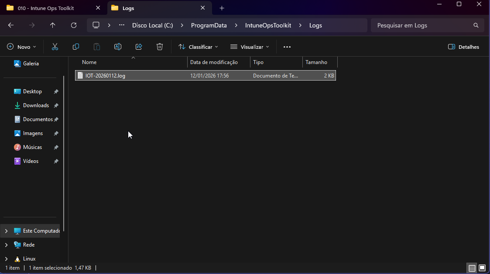

# IntuneOpsToolkit

## Overview
IntuneOpsToolkit is a PowerShell 5.1+ module focused on Intune device readiness and inventory,
built to support automation scenarios in real-world endpoint operations.

## Why this project exists
Intune and EUC teams need dependable readiness and inventory checks that work at scale, generate structured output for automation, and stay safe for enterprise environments.
- No external module dependencies

## Enterprise-ready design decisions
- Idempotent checks and exports
- Exit codes aligned with remediation outcomes
- ProgramData usage for logs and reports
- Proactive Remediation compatibility by design

## Local usage
```powershell
Import-Module .\src\IntuneOpsToolkit.psd1 -Force
Test-IOTAutopilotReadiness -Verbose
```

## Proactive Remediation
- Detection script: `packaging\proactive-remediation\Detect.ps1`
- Remediation script: `packaging\proactive-remediation\Remediate.ps1`

Example:
```powershell
# Detection
powershell.exe -ExecutionPolicy Bypass -File .\packaging\proactive-remediation\Detect.ps1

# Remediation
powershell.exe -ExecutionPolicy Bypass -File .\packaging\proactive-remediation\Remediate.ps1
```

## JSON output example
```json
{
  "Device": {
    "ComputerName": "PC-001",
    "UserName": "user",
    "Domain": "CONTOSO",
    "OSBuild": "19045",
    "TimeZone": "Pacific Standard Time",
    "OrgName": "Contoso"
  },
  "Checks": [
    {
      "Name": "TPM 2.0",
      "Status": "Pass",
      "Evidence": "SpecVersion=2.0,1.16; Enabled=True; Activated=True",
      "RemediationHint": "Enable TPM 2.0 in UEFI/BIOS."
    }
  ],
  "OverallStatus": "Pass",
  "Timestamp": "2025-01-01T12:00:00.0000000-03:00"
}
```

## Screenshots

All outputs, logs, and reports are generated in English by design for global support teams.

### Autopilot readiness (structured JSON)


### Output artifacts (ProgramData)


### Logging (ProgramData)


### Log sample


## Win32 app packaging
- Install: `packaging\win32\install.ps1`
- Uninstall: `packaging\win32\uninstall.ps1`

## Samples
- `samples\Run-Readiness.ps1` generates readiness output and a JSON file.

## Logs and reports
- Logs: `%ProgramData%\IntuneOpsToolkit\Logs\IOT-YYYYMMDD.log`
- Output: `%ProgramData%\IntuneOpsToolkit\Output\`
